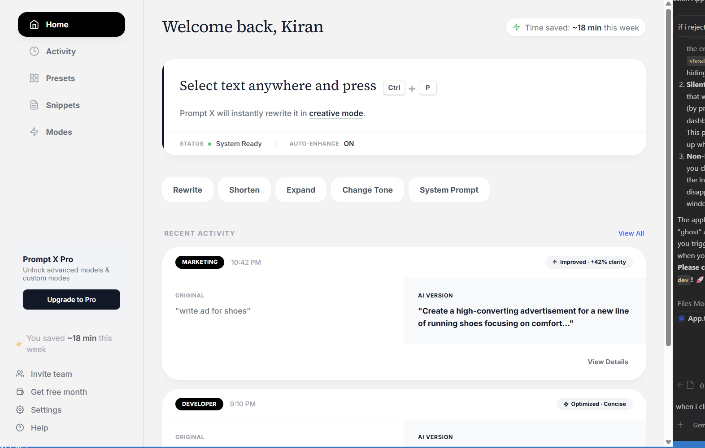
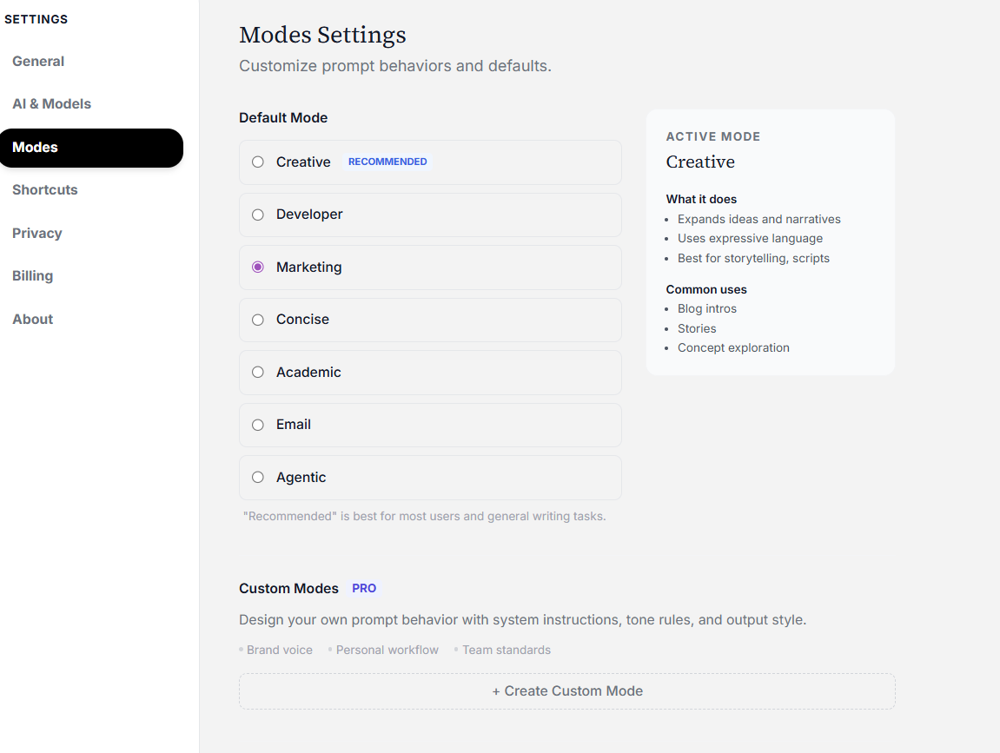

<div align="center">
  
# ⚡ Prompt X

**Rewrite. Enhance. Control AI — Everywhere.**

[](https://tauri.app)
[](https://react.dev)
[](https://www.typescriptlang.org/)
[](LICENSE)

Prompt X is a high-performance, system-wide AI assistant designed to bridge the gap between your thoughts and the screen. Unlike browser-based assistants, Prompt X lives natively in your OS, providing instant AI transformation for any selected text in any application with a single, lightning-fast shortcut.

</div>

<p align="center">
  
</p>
<p align="center">
  
</p>

---

## 📖 Table of Contents

- [✨ Key Features](#-key-features)
- [🛠️ Technology Stack](#️-technology-stack)
- [🚀 Getting Started](#-getting-started)
- [🏗️ Architecture & Structure](#️-architecture--structure)
- [🗺️ Roadmap](#️-roadmap)
- [🤝 Contributing](#-contributing)
- [⚖️ License](#️-license)

---

## ✨ Key Features   

### ♾️ Infinity UI
A zero-latency, glassmorphism-inspired overlay that materializes exactly where you're typing. Designed to be unobtrusive and visually stunning, supporting both Light and Dark modes seamlessly.

### 🧠 Intelligent Auto-Routing
Powered by the Prompt X Neural Engine, the system dynamically selects the most cost-effective and performant Large Language Model (e.g., GPT-4o, Claude 3.5 Sonnet, Gemini 1.5 Pro) optimized for your specific task.

### ⚡ Global Control
Command your text anywhere across your operating system:
- **`Ctrl + P`**: Rewrite and refine selection instantly.
- **`Ctrl + S`**: Shorten and distill text to its core essence.
- **`Ctrl + E`**: Expand ideas with rich detail and relevant examples.
*Fully compatible with all browsers, IDEs, Slack, MS Word, and more.*

### 🛡️ Privacy Controls
Prompt X reads text only after you invoke a shortcut. Provider API keys are session-only, and prompt history is stored locally only when you enable it. Cloud-model requests are governed by the selected provider's policy; use Ollama for local processing.

---

## 🛠️ Technology Stack

Prompt X is built on a modern, robust, and performant stack:

- **Core Engine**: [Tauri v2](https://tauri.app/) — Rust-based foundation ensuring maximum security, low memory footprint, and native performance.
- **Frontend Architecture**: [React 19](https://react.dev/) with [TypeScript](https://www.typescriptlang.org/) for robust, type-safe UI development.
- **Design System**: [Tailwind CSS](https://tailwindcss.com/) for a premium, highly customizable utility-first styling approach.
- **Motion & Fluidity**: [Framer Motion](https://www.framer.com/motion/) for fluid, hardware-accelerated animations.
- **State Management**: [Zustand](https://github.com/pmndrs/zustand) for lightweight, unopinionated state handling.

---

## 🚀 Getting Started

Follow these instructions to set up Prompt X on your local machine for development and testing.

### Prerequisites

Ensure you have the following installed on your system:
- [Node.js](https://nodejs.org/) (v18 or higher)
- [Rust](https://www.rust-lang.org/) (Required for the Tauri core backend)
- [Tauri CLI Dependencies](https://tauri.app/v1/guides/getting-started/prerequisites) (Platform-specific build tools)

### Installation & Local Development

1. **Clone the Repository**
   ```bash
   git clone https://github.com/your-username/prompt-x.git
   cd prompt-x
   ```

2. **Install Node Dependencies**
   ```bash
   npm install
   ```

3. **Launch in Development Mode**
   Start the Vite dev server and the Tauri application window simultaneously:
   ```bash
   npm run tauri dev
   ```

4. **Build for Production**
   Compile a highly optimized, native executable for your OS:
   ```bash
   npm run tauri build
   ```

---

## 🏗️ Architecture & Structure

### System Architecture

```text
                User
                  │
                  ▼
        Global Keyboard Hook
                  │
                  ▼
           Prompt X Overlay
                  │
                  ▼
          Prompt Processing
                  │
        ┌─────────┴─────────┐
        ▼                   ▼
   Prompt Templates     AI Router
                              │
                ┌─────────────┴─────────────┐
                ▼             ▼             ▼
             GPT-4o        Claude       Gemini
                │
                ▼
          Response Formatter
                │
                ▼
      Paste Back Into Application
```

### Codebase Structure

The codebase is organized for scalability and maintainability:

```text
src/
├── core/             # Core AI logic, prompt engineering, and system triggers
├── store/            # Global state management using Zustand
├── ui/               # Modular UI component architecture
│   ├── overlay/      # Infinity UI overlay implementation
│   └── common/       # Reusable UI primitives (buttons, inputs, etc.)
├── utils/            # Tauri IPC bridges and general utility functions
└── App.tsx           # Main application entry point and settings routing
```

---

## 🗺️ Roadmap

We are continuously iterating to make Prompt X the ultimate AI companion. Upcoming milestones include:

- [ ] **Custom Modes PRO**: Design and save your own bespoke AI behaviors and prompt chains.
- [ ] **Local Model Integration**: Native support for Ollama and local LLMs for 100% offline usage.
- [ ] **Team Workspaces**: Shared prompt libraries and centralized billing for organizations.
- [ ] **Plugin Ecosystem**: Open API to extend Prompt X with custom external tools and actions.

---

## 🤝 Contributing

We welcome contributions from the community! Whether you're fixing a bug, improving documentation, or proposing a new feature, your help is appreciated. 

1. Fork the repository
2. Create your feature branch (`git checkout -b feature/AmazingFeature`)
3. Commit your changes (`git commit -m 'Add some AmazingFeature'`)
4. Push to the branch (`git push origin feature/AmazingFeature`)
5. Open a Pull Request

---

## ⚖️ License

Distributed under the MIT License. See [`LICENSE`](LICENSE) for more information.

<p align="center">
  <i>© 2026 Prompt X. Developed in London • San Francisco • Bangalore.</i><br>
  <i>Designed for writers, developers, and power users.</i>
</p>
